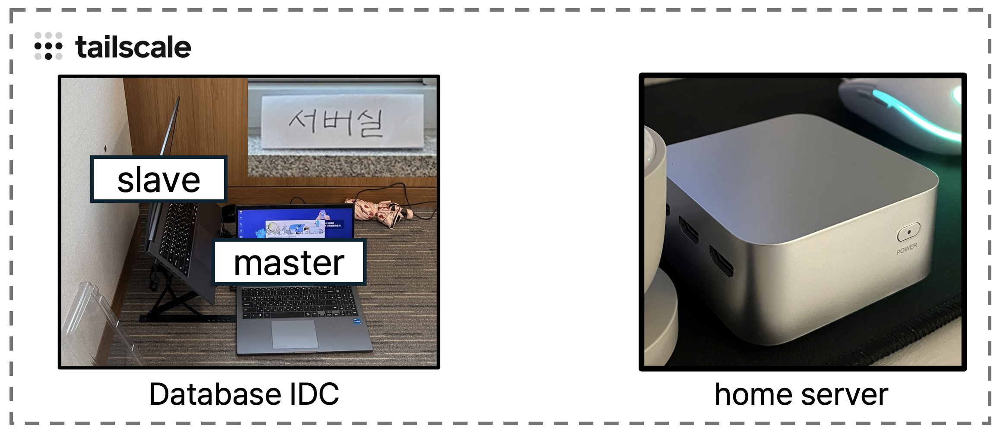

# Readme

## 서비스 개요

PLANIT은 ‘심리적 회계’ 이론에서 착안한 목표지향 자산관리 서비스입니다.
사람들이 마음속으로는 자금을 ‘여행비’, ‘저축’, ‘투자금’처럼 나누어 관리하지만,
실제 금융 계좌에서는 이를 구분하기 어렵다는 점에서 아이디어를 얻었습니다.
PLANIT은 사용자가 목표별로 자산을 시각화·분리 관리할 수 있도록 도와
‘Save Now, Pay Later’ — 저축을 통한 실현 문화를 제안합니다.
MZ세대의 가치소비와 자기주도적 금융습관 형성을 지향합니다.

## 상세 기능

- [🎬 서비스 시연 영상](https://youtu.be/t6MIH4GZkDw)

- 투자 성향 검사

- 은행 연동 (마이 데이터 연동)

- 메인

    - 목표별 자산 배분
    - 계좌 총 잔고 추이
    - 나의 목표

- 목표 설정

    - 계좌 속 자금을 **목표 단위로 나누어 관리**할 수 있게 설계했습니다. '주택 마련', '여행 준비', '단기 투자'처럼 목적별 카테고리를 설정하면, **하나의 계좌 안에서도 가상으로 자금을 분할**하여
      관리할 수 있습니다.

      기존 서비스들이 **별도 계좌 개설**이나 **단순 추적**에 그쳤다면, PLANIT은 진정한 목적 기반 자산 관리를 구현합니다.

    - 세계 여행을 떠나기 1000만원

    - ISA: 70% ⇒ 700만원

        - 상품 할당

    - 예적금: 30% ⇒ 300만원

        - A 계좌의 50%

- 목표 상세

  진행률과 할당 계좌를 기준으로 실시간 목표 상태를 제공하고, 추이 그래프와 AI 요약 리포트로 원인 분석 및 개선권고까지 제시하는 통합 대시보드입니다.

- 투자

    - 전체 투자 내역 수익률
    - 고객 투자 성향별 상품 추천
    - 목표별 최대 수익 상품 추천
        - 사용자 보유 상품 중 더 나은 수익을 기대할 수 있는 대체 상품 추천
    - 리밸런싱
        - 시장 변동에 따른 자산 비중을 분석해 목표 달성을 위한 최적의 매매 전략을 제시

  고객의 투자 성향과 목표를 기반으로 전체 수익률을 분석하고, 더 높은 수익을 기대할 수 있는 상품을 추천합니다.

  시장 변동에 따라 자산 비중을 조정해 목표 달성을 위한 최적의 리밸런싱 전략을 제공합니다.

- 리포트

    - ISA 리포트
        - ISA 비과세 한도 사용 현황
        - ISA vs 일반 계좌 세금 비교
        - 누적 절세 효과
        - 절세율 요약
    - 투자 리포트
        - 일별 수익률 변화
        - 일별 투자금 총액 비교
        - 투자 성향 vs 실제 투자 행동
        - AI 투자 제언
        - 월별 권장 투자 금액
        - AI 투자 조언

- 알림

    - fcm
    - rabbitMQ

## 기술 스택 / 기술 아키텍처

---

.png)

### **🧑‍💻 배치 처리를 위한 DB master-slave 분산 운영**

---

- 다양한 분석 데이터 제공을 위해서 14개의 데일리 배치를 실행하는 환경 고려
- 조회 작업이 많은 api와 쓰기 작업이 많은 batch 작업의 특성을 고려하여 서버, RDB 분리
- master DB에 쓰기 작업을 수행하고 slave(replica) DB에 비동기 복제 적용

| **api_srv**   | 빠른 조회를 위해서 인덱싱된 slave(replica) DB를 조회                |
|---------------|------------------------------------------------------|
| **batch_srv** | 빠른 쓰기를 위해 인덱싱 되지 않은 master DB에 UPDATE/INSERT 등 작업 수행 |

### **🧑‍💻 Database IDC & home server 운영**

---

- 최대한 서버 운영 비용을 절감하기 위해서 개인적으로 사용중인 홈서버와 제공받은 노트북을 활용해

인프라 구축

- DB IDC는 교육 캠퍼스내에서 운영(포트포워딩 불가능), 홈서버는 집에서 포트포워딩 후 운영
- 두 서버간 통신을 위해서 VPN 네트워크 구성

## ERD

---

## 팀원 소개

---

> Backend Developer

- [greensnapback0229](https://github.com/greensnapback0229)
- Ahnseoyeon
- 김동윤

> Frontend Developer

- 박서영
- 권세림
- 유승원